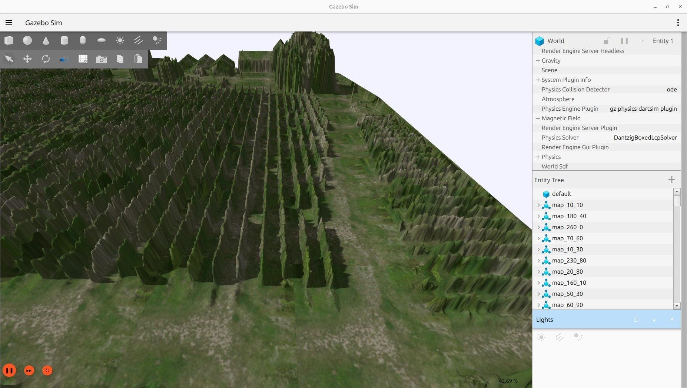

# vineyard_gazebo_world

Gazebo worlds for vineyard environments. Tested with Gazebo Harmonic (8.9.0).



# Setup

```bash
colcon build
source install/setup.bash
```

# Launch

```bash
ros2 launch vineyard_gazebo_world small.launch.py
```
